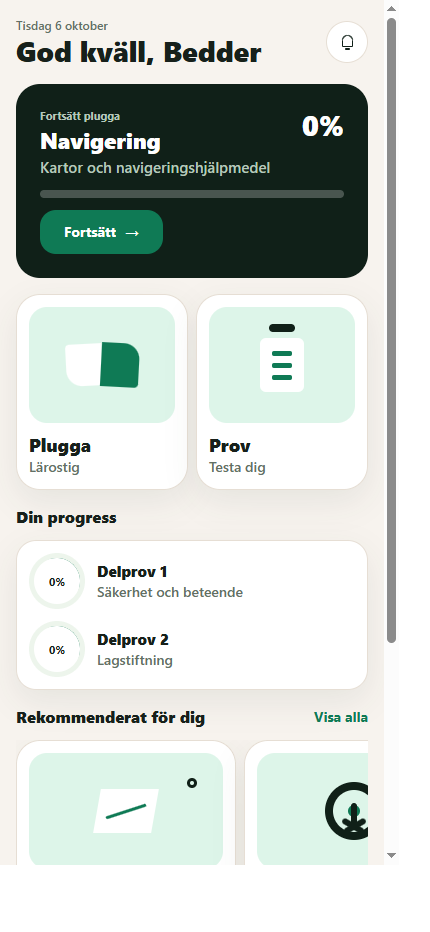
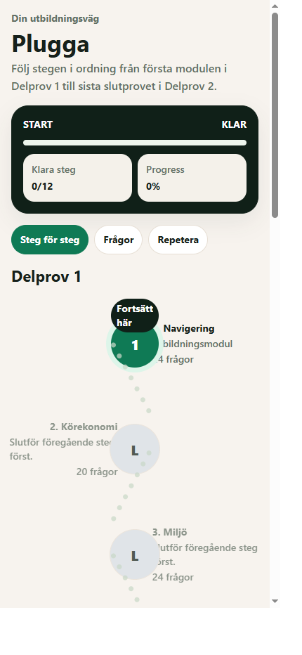
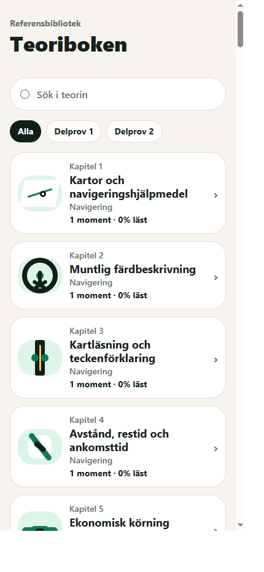

# Taxiteori

Taxiteori is a Swedish taxi-driver theory learning app built with Expo and React Native. It turns curriculum topics into a guided learning path with lessons, knowledge checks, mock exams, progress tracking, and review of exam results.

This is an active portfolio project and learning product prototype. Course material and questions are internally authored training content; the app is not affiliated with Trafikverket and does not reproduce its official question bank or exam.

## Screenshots

Selected screenshots from the running Expo web app at a mobile viewport size:

| Home | Guided study path | Theory book |
| --- | --- | --- |
|  |  |  |

## Product features

- Guided study path for taxi-driver exam areas D1 and D2, with prerequisite and progress states.
- Curriculum-linked subjects, topics, and structured lessons, including explanations, examples, and visual learning assets.
- Subject checkpoints and timed mock exams with saved answers, scoring, pass thresholds, and result review.
- Learning state stored in browser local storage when available, with an in-memory fallback and optional Supabase persistence for deployments with an authenticated session and configured database.
- Swedish theory-book browsing with search and D1/D2 filters.
- Domain tests for question selection, exam blueprints, scoring, progress, and curriculum coverage.

Some areas are intentionally unfinished: user sign-in and account management, payments or subscriptions, a complete official curriculum/question bank, video lessons, and production operations. Supabase persistence requires authentication; configuring the public client environment variables alone does not provide a sign-in flow.

## Tech stack

- Expo, React Native, Expo Router, and TypeScript
- Supabase client and PostgreSQL migrations for optional remote persistence
- A TypeScript domain package for learning flows, progress, question selection, and scoring
- JSON curriculum, lesson, and question content

## Run locally

Requirements: Node.js and npm.

```powershell
npm install
npm run web
```

For a device preview, run `npm start` and open the project in Expo Go.

## Verify

```powershell
npm run typecheck
npm test
```

## Supabase (optional)

The app can use the Supabase persistence client when both Expo public variables are configured and an authenticated user session is available:

```text
EXPO_PUBLIC_SUPABASE_URL=
EXPO_PUBLIC_SUPABASE_ANON_KEY=
```

Only use the public anon/publishable key in the client. Never put a Supabase service-role key or other secret in an `EXPO_PUBLIC_` variable or the app bundle.

Apply the database migrations with the Supabase CLI:

```powershell
supabase link --project-ref your-project-ref
supabase db push
```

The app currently loads curriculum and learning content from the repository. The SQL seed is an outline, not a complete production content import.

## Project structure

- `src/app`: Expo Router screens
- `src/components`: shared UI, learning, and quiz components
- `src/features`: learning and quiz view-model selectors
- `src/lib`: runtime state, local persistence, and optional Supabase persistence
- `packages/domain/src`: domain types and learning/exam logic
- `packages/domain/tests`: domain and curriculum tests
- `data`: curriculum, lesson, question, and visual metadata
- `assets/visuals`: authored SVG learning visuals
- `supabase/migrations`: database schema and row-level security policies
- `docs`: system and domain documentation
